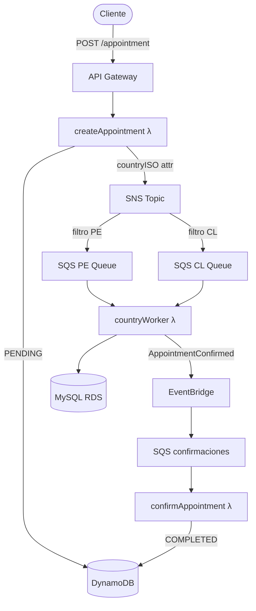

[](https://github.com/apchavez/aws-typescript/actions/workflows/ci.yml)
[](https://sonarcloud.io/summary/new_code?id=apchavez_aws-typescript)
[](https://sonarcloud.io/summary/new_code?id=apchavez_aws-typescript)
[](https://sonarcloud.io/summary/new_code?id=apchavez_aws-typescript)

# Plataforma de Agendamiento de Citas Médicas

Plataforma backend para agendamiento de citas médicas construida con **TypeScript**, **AWS Serverless** y **Clean Architecture**.

Este proyecto simula un flujo de reservas de salud de nivel productivo usando procesamiento asíncrono orientado a eventos, múltiples almacenes de datos y servicios cloud escalables.

> Diseñado como proyecto de portafolio para demostrar habilidades de ingeniería backend en sistemas distribuidos, arquitectura serverless y una estructura de código mantenible.

> **Costo cero en reposo** — el CI solo compila y corre pruebas. No se aprovisiona ningún recurso de AWS hasta que se dispara manualmente el workflow de deploy.

---

## Stack Tecnológico

| Capa | Tecnología |
|---|---|
| Lenguaje | TypeScript / Node.js 20 |
| Runtime | AWS Lambda (nodejs20.x, arm64) |
| API | API Gateway HTTP API |
| Almacén de estado | DynamoDB |
| Almacén relacional | MySQL 8 en RDS (por país) |
| Mensajería | SNS → SQS fan-out |
| Bus de eventos | EventBridge |
| IaC / Deploy | Serverless Framework v4 |
| Desarrollo local | serverless-offline, Docker |
| Testing | Jest + ts-jest |
| Documentación | OpenAPI / Swagger |

---

## Arquitectura



> **Este proyecto usa arquitectura serverless sobre AWS Lambda. Kubernetes no aplica.**

La aplicación sigue los principios de **Clean Architecture**:

- **Capa de dominio** — Entidades (`Appointment`) y contratos de puertos (`IAppointmentStateRepo`, `IMessageBus`, `ICountryBookingRepo`)
- **Capa de aplicación** — Casos de uso (`AppointmentService`, `AppointmentCountryService`)
- **Capa de infraestructura** — Adaptadores para DynamoDB, MySQL, SNS y EventBridge — cada uno implementando un puerto de dominio
- **Capa de API** — Handlers de AWS Lambda (delgados: delegan a los casos de uso, devuelven respuestas HTTP)

### Flujo de Eventos Serverless

```text
Cliente
  ↓
API Gateway (HTTP API)
  ↓
createAppointment Lambda
  ↓  guarda status=pending
DynamoDB
  ↓  publica con MessageAttribute countryISO
SNS Topic (appointmentTopic)
  ↓  filtrado por countryISO → cola PE o CL
SQS (appointments-pe / appointments-cl)
  ↓  Lambda de country worker
MySQL RDS (BD específica del país)
  ↓  publica AppointmentConfirmed
EventBridge (appointments-bus)
  ↓
SQS (appointments-confirmaciones)
  ↓
confirmAppointment Lambda
  ↓  actualiza status=completed
DynamoDB
```

Los mensajes que fallan después de 3 reintentos se enrutan a una Dead Letter Queue (retención de 14 días) por cada cola SQS.

---

## Estructura del Proyecto

```text
src/
├── api/lambda/
│   ├── appointment.ts              Handlers HTTP (crear, listar, cancelar, reprogramar, historial) + handler de confirmación SQS
│   ├── appointment_country.ts      Country worker único (PE + CL, país derivado de `countryISO`)
│   └── authorizer.ts              HTTP API Lambda Authorizer — validación JWT, caché de secreto en SSM
├── app/usecases/
│   ├── appointment.service.ts      Caso de uso principal de reserva/cancelación/reprogramación/historial
│   └── appointment-country.service.ts  Caso de uso de reserva + confirmación específico por país
├── docs/
│   └── openapi.yaml                Contrato OpenAPI 3.1
├── domain/
│   ├── entities/
│   │   ├── Appointment.ts
│   │   └── AppointmentEvent.ts     Registro de event-sourcing para el endpoint de historial
│   ├── ports/
│   │   ├── IAppointmentEventStore.ts
│   │   ├── IAppointmentNotifier.ts
│   │   ├── IAppointmentStateRepo.ts
│   │   ├── IConfirmationBus.ts
│   │   ├── ICountryBookingRepo.ts
│   │   └── IMessageBus.ts
│   └── types.ts                    CountryISO | Status | EventSource | Role
├── infra/
│   ├── cfn-response.ts             Helper compartido de respuesta para custom resources de CloudFormation
│   ├── config/ddb.ts               Cliente de documentos de DynamoDB
│   ├── jwt.ts                      Firma / verificación JWT HS256 (timingSafeEqual, base64url)
│   ├── rds-ca-bundle.ts            Bundle CA global de AWS RDS, embebido para verificación TLS estricta
│   ├── tracing.ts                  Wrapper captureAWSClient<T>() para el SDK v3 de AWS X-Ray
│   ├── messaging/
│   │   ├── eventbridge.service.ts  Implementación de IConfirmationBus (envuelta en resiliencia)
│   │   └── sns.service.ts          Implementación de IMessageBus (envuelta en resiliencia)
│   ├── notifications/
│   │   ├── SesAppointmentNotifier.ts  Implementación de IAppointmentNotifier (envío de correo best-effort vía SES)
│   │   └── NoOpAppointmentNotifier.ts Se usa cuando SES_SENDER_ADDRESS no está configurado
│   ├── repos/
│   │   ├── DynamoAppointmentStateRepo.ts   Implementación de IAppointmentStateRepo (+ paginación por cursor)
│   │   ├── DynamoAppointmentEventStore.ts  Implementación de IAppointmentEventStore
│   │   └── MySQLCountryBookingRepo.ts      Implementación de ICountryBookingRepo
│   ├── db-init.ts                  Custom resource de CloudFormation — crea las tablas MySQL
│   └── secrets-init.ts             Custom resource de CloudFormation — genera el password en SSM
├── index.ts                        Factories de inyección de dependencias (appointmentMakeService, appointmentCountryMakeService)
└── shared/
    ├── auth.ts                     Extractor de contexto del Lambda Authorizer (getAuthContext)
    ├── errors.ts                    NotFoundError / ConflictError — mapeados a 404/409 en los handlers
    ├── http.ts                     Helpers de respuesta HTTP (ok / created / accepted / bad / forbidden / notFound / conflict / internal)
    ├── logger.ts                    Logger JSON estructurado (compatible con CloudWatch)
    └── resilience.ts                Retry (3 intentos, backoff exponencial) + circuit breaker para llamadas al message bus
postman/
├── aws-typescript.postman_collection.json
├── aws-typescript.local.postman_environment.json
└── aws-typescript.dev.postman_environment.json
tests/
├── appointment.handler.unit.test.ts
├── appointment.service.unit.test.ts
├── appointment_country.unit.test.ts
├── appointment-country.service.unit.test.ts
├── authorizer.unit.test.ts
├── dynamo-appointment-state-repo.unit.test.ts
├── dynamo-appointment-event-store.unit.test.ts
├── ses-appointment-notifier.unit.test.ts
├── sns.service.unit.test.ts
├── resilience.unit.test.ts
└── jwt.unit.test.ts
```

---

## Autenticación

Todos los endpoints HTTP requieren un token JWT Bearer en el header `Authorization`.

```
Authorization: Bearer <token>
```

Los tokens son JWTs **HS256** firmados con un secreto almacenado en SSM en `/appointments/jwt/secret`. El secreto se genera automáticamente en el primer deploy mediante el custom resource de CloudFormation `JwtSecretInit`.

### Roles

| Rol | `POST /appointments` | `GET /appointments/{insuredId}` |
|------|----------------------|----------------------------------|
| `agent` | Cualquier `insuredId` | Cualquier `insuredId` |
| `insured` | Solo su propio `insuredId` (debe coincidir con el `sub` del JWT) | Solo su propio `insuredId` |

Las solicitudes con un token válido pero rol insuficiente devuelven **403 Forbidden**.

### Generar un token (dev/testing)

```typescript
import { signJwt } from "./src/infra/jwt";

// Token de agente — puede operar sobre cualquier asegurado
const agentToken = signJwt("agent-001", "agent", "<secret-from-ssm>");

// Token de asegurado — restringido a su propio insuredId
const insuredToken = signJwt("01234", "insured", "<secret-from-ssm>");

// Obtener el secreto:
// aws ssm get-parameter --name /appointments/jwt/secret --with-decryption --query Parameter.Value --output text
```

El Lambda Authorizer (`src/api/lambda/authorizer.ts`) valida el token e inyecta `sub` y `role` en el contexto de la solicitud. API Gateway cachea el resultado del authorizer durante 5 minutos por token.

---

## API

### Crear cita

```http
POST /appointments
Content-Type: application/json

{
  "insuredId": "12345",
  "scheduleId": 10,
  "countryISO": "PE",
  "contactEmail": "insured@example.com"
}
```

`contactEmail` es opcional. Cuando está presente, se propaga a `cancel`/`reschedule`/`complete` para que los deploys con `SES_SENDER_ADDRESS` configurado puedan enviar correos de notificación best-effort (ver [Notificaciones](#notificaciones)).

**Respuesta 201**

```json
{
  "appointmentUuid": "b3d2f1a0-...",
  "insuredId": "12345",
  "scheduleId": 10,
  "countryISO": "PE",
  "status": "pending",
  "createdAt": "2026-06-01T12:00:00.000Z",
  "updatedAt": "2026-06-01T12:00:00.000Z",
  "contactEmail": "insured@example.com"
}
```

**Errores de validación (400)**

| Condición | Mensaje |
|---|---|
| Falta el body | `Required body` |
| JSON mal formado | `Invalid body (JSON)` |
| Faltan campos | `insuredId, scheduleId and countryISO are required` |
| `insuredId` no tiene 5 dígitos | `insuredId must be 5 digits` |
| País inválido | `countryISO must be 'PE' or 'CL'` |
| `scheduleId` no numérico o ≤ 0 | `scheduleId must be a positive integer` |

---

### Listar citas por asegurado

```http
GET /appointments/{insuredId}?pageSize=20&cursor=<opaque-token>
```

`pageSize` (por defecto 20, máximo 100) y `cursor` son opcionales. `cursor` es un token opaco codificado en base64url — pasa el `nextCursor` de la respuesta anterior tal cual para obtener la siguiente página; no lo construyas manualmente.

**Respuesta 200**

```json
{
  "items": [
    {
      "appointmentUuid": "b3d2f1a0-...",
      "insuredId": "12345",
      "scheduleId": 10,
      "countryISO": "PE",
      "status": "completed",
      "createdAt": "2026-06-01T12:00:00.000Z",
      "updatedAt": "2026-06-01T12:00:00.000Z"
    }
  ],
  "nextCursor": null
}
```

---

### Cancelar cita

```http
DELETE /appointments/{appointmentUuid}
```

Solo una cita en estado `pending` puede cancelarse. Los llamadores `insured` solo pueden cancelar sus propias citas (verificado mediante un `GetItem` antes del cambio de estado).

**Respuesta 200**

```json
{ "message": "Appointment cancelled", "appointmentUuid": "b3d2f1a0-..." }
```

| Condición | Estado | Mensaje |
|---|---|---|
| La cita no existe | 404 | `Appointment not found: <id>` |
| Un `insured` intenta cancelar la cita de otro | 403 | `insured can only cancel their own appointments` |
| La cita no está en `pending` | 409 | `Only a PENDING appointment can be cancelled` |

---

### Reprogramar cita

```http
PATCH /appointments/{appointmentUuid}/reschedule
Content-Type: application/json

{ "newScheduleId": 42 }
```

Marca la cita `pending` existente como `rescheduled` y crea una **nueva** cita `pending` para el nuevo horario, que fluye por el mismo pipeline SNS → SQS → country-worker → EventBridge que una creación nueva. Misma regla de propiedad que la cancelación.

**Respuesta 202**

```json
{ "message": "Appointment rescheduled", "newAppointmentUuid": "c4e3f2b1-...", "newScheduleId": 42 }
```

---

### Obtener historial de una cita

```http
GET /appointments/{appointmentUuid}/history
```

Devuelve el registro completo y ordenado de eventos de una cita — cada transición de estado registrada por la capa liviana de event-sourcing (tabla `AppointmentEvents` en DynamoDB).

**Respuesta 200**

```json
[
  {
    "eventId": "e1...",
    "appointmentUuid": "b3d2f1a0-...",
    "eventType": "APPOINTMENT_CREATED",
    "insuredId": "12345",
    "scheduleId": 10,
    "countryISO": "PE",
    "status": "pending",
    "occurredAt": "2026-06-01T12:00:00.000Z"
  }
]
```

Los llamadores `insured` solo pueden ver el historial de su propia cita (verificado contra el `insuredId` del primer evento devuelto — un historial vacío de una cita inexistente/ajena no queda bloqueado por esta verificación, ya que no hay nada contra qué comparar).

---

## Notificaciones

Notificaciones de correo best-effort en `complete`/`cancel`/`reschedule` vía Amazon SES, replicando el notificador de Communication Services del proyecto hermano de Azure. Controlado por la variable de entorno `SES_SENDER_ADDRESS`:

- **Sin configurar (por defecto)**: se usa un `NoOpAppointmentNotifier` — no se envían correos, nada que configurar.
- **Configurada**: un `SesAppointmentNotifier` envía un correo de texto plano al `contactEmail` de la cita (se omite silenciosamente si no está presente). SES requiere que la dirección/dominio remitente sea una **identidad verificada** — el acceso SES de una cuenta AWS nueva también inicia en modo sandbox, que solo permite enviar a otras direcciones verificadas hasta que se solicite acceso de producción.

Un fallo de notificación siempre se registra y se absorbe — nunca hace fallar la operación del ciclo de vida de la cita que lo originó.

---

## Variables de Entorno

Las siguientes variables de entorno son inyectadas por Serverless Framework en tiempo de deploy vía referencias de CloudFormation. No hay valores reales hardcodeados.

| Variable | Descripción |
|---|---|
| `TABLE_APPOINTMENTS` | Nombre de la tabla DynamoDB |
| `TABLE_APPOINTMENT_EVENTS` | Nombre de la tabla DynamoDB para el historial/log de eventos de citas |
| `SES_SENDER_ADDRESS` | Identidad remitente verificada en SES para notificaciones; sin configurar por defecto (se usa `NoOpAppointmentNotifier` — ver [Notificaciones](#notificaciones)) |
| `SNS_APPOINTMENTS_ARN` | ARN del topic SNS |
| `EB_BUS_NAME` | Nombre del bus de EventBridge |
| `SQS_PE_URL` / `SQS_PE_ARN` | Cola SQS para Perú |
| `SQS_CL_URL` / `SQS_CL_ARN` | Cola SQS para Chile |
| `CONFIRMATIONS_SQS_URL` / `CONFIRMATIONS_SQS_ARN` | Cola de confirmaciones |
| `RDS_PE_HOST_SSM` / `RDS_CL_HOST_SSM` | Rutas de parámetros SSM para el host de RDS |
| `RDS_PASSWORD_SSM` | Ruta del parámetro SSM para el password de RDS |
| `RDS_USER` | Usuario de RDS |
| `RDS_PE_PORT` / `RDS_CL_PORT` | Puerto de RDS (por defecto 3306) |
| `RDS_PE_DATABASE` / `RDS_CL_DATABASE` | Nombres de base de datos por país |

Para desarrollo local con serverless-offline, copia `.env.example` a `.env` y completa tus valores (`.env` está en gitignore).

---

## Desarrollo Local

### Instalar dependencias

```bash
npm install
```

### Ejecutar localmente (serverless-offline)

```bash
npm run offline
# API disponible en http://localhost:3000
```

El Dockerfile en la raíz del proyecto envuelve este comando por conveniencia:

```bash
docker build -t clinic-scheduling-platform .
docker run -p 3000:3000 clinic-scheduling-platform
```

> Docker se provee solo para desarrollo local. El deploy de producción es serverless vía AWS Lambda.

### Desarrollo Local con Localstack

Levanta equivalentes locales de DynamoDB, SQS, SNS, SSM y EventBridge — más dos contenedores MySQL para los country workers — sin necesitar una cuenta de AWS.

**Prerrequisitos:** Docker y Docker Compose.

```bash
# 1. Levantar Localstack + MySQL (PE en :3307, CL en :3308)
npm run localstack:up

# 2. Copiar el archivo de entorno local (los endpoints de Localstack ya están preconfigurados)
cp .env.localstack .env

# 3. Levantar la API con serverless-offline
npm run offline
# API en http://localhost:3000

# 4. Detener y eliminar contenedores al terminar
npm run localstack:down
```

Recursos creados automáticamente por `scripts/localstack-init.sh` al iniciar Localstack:

| Recurso | Nombre |
|---|---|
| Tabla DynamoDB | `Appointments` (con GSI `byInsured`) |
| Topic SNS | `appointmentTopic` |
| Colas SQS | `appointments-pe`, `appointments-cl`, `appointments-confirmaciones` + 3 DLQs |
| Suscripciones SNS → SQS | Filtro PE `countryISO=PE`, filtro CL `countryISO=CL` |
| Bus EventBridge | `appointments-bus` |
| Parámetros SSM | `/appointments/jwt/secret`, `/appointments/rds/*` |

> **Nota:** el tracing de X-Ray se deshabilita automáticamente cuando `AWS_ENDPOINT_URL` apunta a Localstack.

### Build

```bash
npm run build
# Salida: dist/
```

---

## Testing

Los tests unitarios cubren:

- Validación del handler Lambda, RBAC, paginación y enrutamiento para crear/listar/cancelar/reprogramar/historial (`appointment.handler.unit.test.ts`)
- Lógica de negocio de la capa de servicio contra fakes de puertos escritos a mano: crear/completar/cancelar/reprogramar/historial, invariantes de propiedad/estado (`appointment.service.unit.test.ts`)
- Adaptadores DynamoDB: repositorio de estado (findById, paginación por cursor, transiciones de estado) y event store (clave de ordenamiento compuesta, orden cronológico) (`dynamo-appointment-state-repo.unit.test.ts`, `dynamo-appointment-event-store.unit.test.ts`)
- Notificador SES: envío best-effort, omisión silenciosa sin contactEmail, fallos absorbidos sin propagarse (`ses-appointment-notifier.unit.test.ts`)
- Publicación en el message bus SNS + propagación de errores (`sns.service.unit.test.ts`)
- Retry + circuit breaker: timing de backoff, transiciones open/half-open/closed basadas en tasa de fallo (`resilience.unit.test.ts`)
- Caso de uso por país: reserva + confirmación, propagación de errores (`appointment-country.service.unit.test.ts`)
- Handlers del country worker: procesamiento SQS, desenvoltura del envelope SNS, re-lanzamiento en caso de fallo (`appointment_country.unit.test.ts`)
- Lambda Authorizer: validación JWT, caché en SSM, verificación de rol y expiración (`authorizer.unit.test.ts`)
- Utilidad JWT: ciclo firma/verificación, detección de manipulación, cumplimiento de expiración (`jwt.unit.test.ts`)

```bash
npm test
```

### Cobertura

```bash
npm run test:coverage
# Reportes en: coverage/
```

La cobertura se exige con un **mínimo del 80%** (statements, branches, functions, lines). Los adaptadores de infraestructura que requieren conexiones AWS reales (MySQL, custom resources de CloudFormation) quedan excluidos de ese umbral.

---

## Postman

La carpeta `postman/` contiene la colección y dos entornos.

| Archivo | Propósito |
|---|---|
| `aws-typescript.postman_collection.json` | Todas las solicitudes con scripts de test inline |
| `aws-typescript.local.postman_environment.json` | `baseUrl = http://localhost:3000` (serverless-offline) |
| `aws-typescript.dev.postman_environment.json` | `baseUrl = https://change-me.execute-api.region.amazonaws.com/dev` |

Importa tanto la colección como el entorno deseado en Postman, activa el entorno y ejecuta la colección de arriba a abajo. `Cancel Appointment` actúa sobre la cita PE y `Reschedule Appointment` sobre la cita CL (ambas creadas antes en la misma corrida) — se mantienen deliberadamente separadas, ya que ambas acciones requieren una cita `pending` y entrarían en conflicto 409 entre sí si compartieran una.

---

## OpenAPI

El contrato de la API es **OpenAPI 3.1**, definido en [`src/docs/openapi.yaml`](src/docs/openapi.yaml). Documenta ambos endpoints HTTP, el esquema de seguridad `BearerAuth` (JWT Bearer) y las reglas de acceso basadas en rol (`agent` vs `insured`).

**Generar documento HTML estático (Redocly):**

```bash
npm run docs
# Salida: docs/swagger.html — abrir en cualquier navegador
```

**Validar el spec:**

```bash
npx redocly lint src/docs/openapi.yaml
```

---

## Deploy

### Prerrequisitos

1. Configura tus credenciales de AWS (`aws configure` o variables de entorno).
2. Define los IDs de VPC y subnets para las instancias RDS como variables de entorno:

```bash
export RDS_VPC_ID=vpc-xxxxxxxxxxxxxxx
export RDS_SUBNET_1=subnet-xxxxxxxxxxxxxxx
export RDS_SUBNET_2=subnet-xxxxxxxxxxxxxxx
export RDS_ROUTE_TABLE_ID=rtb-xxxxxxxxxxxxxxx
```

Estas variables son leídas por `serverless.yml` en tiempo de deploy vía `${env:RDS_VPC_ID}`. No hay IDs reales commiteados en el repositorio. `RDS_ROUTE_TABLE_ID` es la tabla de rutas asociada a las dos subnets anteriores (la tabla de rutas principal de la VPC si se usan sus subnets por defecto) — es donde se adjunta el S3 Gateway VPC Endpoint gratuito para que las Lambdas dentro de la VPC (`dbInit`, `appointmentCountry`) puedan alcanzar S3 sin un NAT Gateway.

3. En una cuenta AWS del plan **Free**, RDS rechaza un `BackupRetentionPeriod` superior al que el plan permite — `serverless.yml` fija `custom.rds.backupRetentionDays` en `0` por defecto (backups automáticos deshabilitados) justo por esta razón. Una vez que la cuenta pasa a Paid, sobrescríbelo con `export RDS_BACKUP_RETENTION_DAYS=7` (o cualquier valor) antes de desplegar.

4. En el **primer deploy** a una cuenta/región de AWS nueva, precrea el parámetro SSM del password maestro de RDS antes de correr `serverless deploy`. CloudFormation resuelve las referencias dinámicas `{{resolve:ssm-secure:...}}` para toda la plantilla antes de crear cualquier recurso, así que no puede esperar al custom resource dentro del stack que de otro modo generaría este valor:

```bash
aws ssm put-parameter \
  --name /appointments/rds/password \
  --type SecureString \
  --key-id alias/aws/ssm \
  --value "$(openssl rand -hex 20)"
```

Usa `-hex`, no `-base64`, aquí: RDS para MySQL rechaza valores de `MasterUserPassword` mayores a 41 caracteres (`base64 32` produce 44) y prohíbe `/`, `@`, `"` y espacios (todos caracteres válidos de salida base64). Una cadena hex de 20 bytes tiene exactamente 40 caracteres de `0-9a-f` puro — bajo el límite y libre de cualquier carácter prohibido, incluyendo el `\r` final que `openssl` puede emitir en Windows/Git Bash. Cada uno de estos modos de fallo se manifiesta con el mismo `Validation failed with 1 error(s)` opaco a nivel de stack, sin detalle a nivel de recurso — nada apunta directamente al password.

El workflow `deploy.yml` de GitHub Actions hace esto automáticamente (idempotente — se omite si el parámetro ya existe), así que este paso manual solo es necesario para un deploy local/manual.

**Nota de diseño — sin NAT Gateway, solo un S3 Gateway Endpoint gratuito:** `dbInit` y `appointmentCountry` corren dentro de la VPC (necesario para alcanzar RDSPE/RDSCL, que no son públicamente accesibles), pero este repo no aprovisiona un NAT Gateway para mantener la factura de AWS en cero. Eso significa que ninguna de estas dos funciones puede alcanzar APIs públicas de AWS en tiempo de ejecución por defecto — incluyendo el propio mecanismo de respuesta de custom resource de CloudFormation, que es un HTTPS PUT a una URL de S3 pre-firmada. `S3VpcEndpoint` (un Gateway endpoint `AWS::EC2::VPCEndpoint`, gratuito — sin cargo por hora a diferencia de un NAT Gateway o Interface Endpoint) soluciona eso específicamente para S3, que es lo que permite que `dbInit` pueda reportar SUCCESS/FAILED de vuelta a CloudFormation. La obtención del password de RDS se resuelve de la misma manera sin costo, pero no vía una referencia dinámica `{{resolve:ssm-secure:...}}` directamente en las propiedades `Password`/`RDS_PASSWORD` — CloudFormation solo soporta esa sintaxis en una lista reducida de propiedades permitidas (el propio `MasterUserPassword` de RDS entre ellas) y la rechaza en cualquier otro lugar con un error de validación a nivel de stack. En su lugar, `SecretsInitCustom` (respaldado por una Lambda con acceso normal a internet, no atada a la VPC) obtiene/crea el password vía SSM y lo devuelve en el `Data` de la respuesta del custom resource, y `dbInit`/`appointmentCountry` lo toman vía `Fn::GetAtt: [SecretsInitCustom, value]` — un trade-off de seguridad real de cualquier forma, no gratuito: el password queda visible en la plantilla/consola de CloudFormation en vez de solo en SSM. La llamada `EventBridgeConfirmationBus.publish` (PutEvents) de `appointmentCountry` **no** está cubierta por nada de esto — es una llamada real a una API en tiempo de ejecución, no un secreto resoluble, y llama a un servicio (`events`) que no tiene opción de Gateway Endpoint (solo Interface Endpoints, que sí tienen cargo por hora) — fallará con `ETIMEDOUT` en cuanto un mensaje de cita real llegue al handler, sea cual sea el país. Agrega un VPC Interface Endpoint para `events` (o un NAT Gateway) antes de confiar en ese camino de punta a punta.

### Desplegar el stack

```bash
npx serverless deploy
```

### Eliminar el stack

```bash
npx serverless remove
```

> `deploy.yml` es solo manual, disparado vía `workflow_dispatch` con un `stage` (dev/staging/prod) y `region` elegidos. No corre automáticamente después de `CI` — no hay una cuenta AWS/licencia de Serverless Framework activa detrás de este proyecto de portafolio, así que un disparo automático simplemente fallaría en cada push. Cada corrida está protegida por un GitHub Environment que coincide con el stage elegido. Secretos requeridos: `AWS_ACCESS_KEY_ID`, `AWS_SECRET_ACCESS_KEY`.
>
> `destroy.yml` (también solo `workflow_dispatch`) corre `serverless remove` para un `stage`/`region` elegidos, protegido por el mismo Environment por stage y un input explícito `confirm: DELETE` para evitar la eliminación accidental del stack — replica los workflows de destroy de Azure/Spring. Ambas instancias RDS tienen `DeletionProtection: true` (un trade-off real de producción, no un bug — esta es una plataforma de citas médicas), así que `destroy.yml` lo deshabilita en ambas instancias vía `aws rds modify-db-instance` justo antes de `serverless remove`; un `aws rds modify-db-instance --no-deletion-protection` manual solo es necesario si desmontas el stack de alguna otra forma. El `DependsOn` de `DbInit` también lo ata a `LambdaEgressToRds` — el propio handler de eliminación del custom resource necesita que esa misma regla de egress a MySQL siga existiendo para correr su limpieza, y CloudFormation no tiene forma de saberlo sin una dependencia explícita (aprendido a la fuerza: sin esto, la regla de egress puede eliminarse antes o junto con `DbInit`, y el custom resource atascado cuelga por el timeout completo de ~1h de CloudFormation sin más solución real que `delete-stack --retain-resources DbInit`).
>
> `cost-guard.yml` corre diariamente (06:00 UTC) y no necesita dispararse manualmente — verifica el `CreationTime` del stack `dev` vía `describe-stacks`, y si tiene más de 48h (configurable vía el input `max_age_hours` en una corrida manual), dispara `destroy.yml` él mismo vía la API de GitHub. No hace nada si no hay nada desplegado. Existe para que un deploy de demostración nunca siga facturando en silencio días después.

---

## Logs

```bash
npx serverless logs -f createAppointment -t
npx serverless logs -f appointmentCountry -t
npx serverless logs -f confirmAppointment -t
```

---

## CI/CD

CI corre en cada push y pull request a `main`.

Pipeline: `install → lint → build → test → coverage`

No se requieren credenciales de AWS. No se realiza ningún deploy automático.

Ver `.github/workflows/ci.yml`.

`integration.yml` (manual, `workflow_dispatch`) corre la colección de Postman vía Newman más los tests de carga de k6 (`tests/load/appointments.js`) contra un `base_url` real ya desplegado — genera un JWT de prueba HS256 firmado con el mismo secreto que quedó en SSM (`/appointments/jwt/secret`) tras `deploy.yml`, replica el patrón de los hermanos `azure-python`/`gcp-go`.

---

## Qué Demuestra Este Proyecto

- Clean Architecture con inversión de dependencias (ports & adapters) — la capa de dominio no tiene dependencias de infraestructura
- Sistemas orientados a eventos con fan-out de SNS → SQS por país (filtro por MessageAttribute `countryISO`)
- Diseño multi-base de datos: DynamoDB para seguimiento de estado, MySQL para persistencia relacional por país
- Un único worker Lambda por cola SQS de múltiples países (país derivado del propio evento) en vez de una función duplicada por país — menos infraestructura que mantener, misma cobertura de servicios
- Dead Letter Queues (retención de 14 días) en todas las colas SQS — confiabilidad por diseño
- Logging JSON estructurado compatible con CloudWatch Logs Insights
- Validación de entrada consistente (formato + tipo) alineada con el contrato OpenAPI
- Manejo de errores 500 en el límite de la Lambda — las excepciones no manejadas nunca se propagan como rejections sin capturar
- Eventos Lambda tipados (`APIGatewayProxyEvent`, `SQSEvent`, `CloudFormationCustomResourceEvent`)
- AWS Serverless Framework con custom resources de CloudFormation para el bootstrap de BD y secretos
- Autenticación JWT Bearer vía HTTP API Lambda Authorizer — HS256, `timingSafeEqual`, secreto respaldado por SSM, caché de resultado de 300s
- Testing unitario con clientes del SDK de AWS mockeados (`aws-sdk-client-mock`) y mocks de interfaces simples
- Cobertura Jest exigida al 80% en 139 tests distribuidos en 18 suites
- Event sourcing liviano: historial completo de citas vía un log de eventos en DynamoDB, independiente del estado actual
- Paginación basada en cursor sobre un GSI de DynamoDB, siguiendo el mismo contrato de paginación que el proyecto hermano de Azure
- Notificaciones de correo best-effort (Amazon SES) que nunca bloquean el ciclo de vida de la cita si fallan
- Retry hecho a mano (backoff exponencial) + circuit breaker alrededor de las llamadas al message bus, replicando la configuración de Resilience4j del proyecto hermano de Azure (3 intentos, ventana deslizante de 10 llamadas, umbral de fallo del 50%, estado abierto de 30s)

---

## Observabilidad

### Logging

Todas las funciones Lambda emiten logs JSON estructurados a stdout, que CloudWatch Logs captura automáticamente. Cada entrada de log incluye `timestamp`, `level`, `message` y campos de contexto arbitrarios. Pasa `{ requestId: context.awsRequestId }` para correlacionar entradas de log con los IDs de traza de X-Ray:

```typescript
logger.info('appointment created', { requestId: ctx.awsRequestId, appointmentUuid });
```

### Trazabilidad Distribuida (X-Ray)

El tracing activo está habilitado en todas las funciones Lambda y en API Gateway (`tracing: lambda: true / apiGateway: true` en `serverless.yml`). AWS X-Ray captura:

- Duración de cold start vs invocación warm por función
- Segmentos API Gateway → Lambda automáticamente
- Llamadas al SDK de AWS instrumentadas vía `captureAWSClient()` en `src/infra/tracing.ts`

El rol IAM incluye permisos `xray:PutTraceSegments` y `xray:PutTelemetryRecords`. Las trazas son visibles en la consola de AWS X-Ray y se pueden consultar vía CloudWatch ServiceLens.

### Alarmas de CloudWatch

Tres **alarmas de CloudWatch** se disparan cuando cualquier Dead Letter Queue acumula al menos un mensaje, señalando un fallo de procesamiento que necesita investigación:

| Alarma | DLQ | Indica |
|-------|-----|-----------|
| `clinic-scheduling-platform-pe-dlq-depth` | `appointments-pe-dlq` | El country worker no pudo agendar la cita en RDS de Perú |
| `clinic-scheduling-platform-cl-dlq-depth` | `appointments-cl-dlq` | El country worker no pudo agendar la cita en RDS de Chile |
| `clinic-scheduling-platform-confirmations-dlq-depth` | `appointments-confirmaciones-dlq` | La Lambda de confirmación no pudo actualizar el estado en DynamoDB |

Las alarmas publican en un topic SNS (`clinic-scheduling-platform-alarms`) desplegado junto con el stack. Para recibir notificaciones por correo, define `ALARM_EMAIL` antes de desplegar:

```bash
export ALARM_EMAIL=your@email.com
npx serverless deploy
```

El ARN del topic SNS se exporta como salida de CloudFormation (`clinic-scheduling-platform-alarms-topic-arn`) para que stacks o pipelines de CI posteriores puedan agregar suscriptores adicionales.

---

## Proyectos Relacionados

Este repo forma pareja con **azure-python** y **gcp-go**: los tres implementan el mismo dominio de agendamiento de citas y Clean Architecture, los mismos 5 endpoints, distinto cloud/lenguaje — mantenidos en paridad funcional a propósito. Los cuatro proyectos fullstack de Kubernetes forman un segundo grupo así, compartiendo un dominio de Gestión de Productos en su lugar.

| Proyecto | Descripción |
|---|---|
| [azure-python](https://github.com/apchavez/azure-python) | Migración a Azure de esta plataforma — mismo dominio y Clean Architecture, reescrito en **Python** sobre Azure Functions, Cosmos DB y Service Bus |
| [gcp-go](https://github.com/apchavez/gcp-go) | Migración a GCP de esta plataforma — mismo dominio y Clean Architecture, escrito en **Go** sobre Cloud Run, Firestore y Pub/Sub |
| [quarkus-react](https://github.com/apchavez/quarkus-react) | Plataforma de Gestión de Productos — backend Quarkus, frontend React, MongoDB, Redis, eventos Kafka, Kubernetes |
| [spring-webflux-angular](https://github.com/apchavez/spring-webflux-angular) | Mismo dominio de Gestión de Productos que arriba, backend reactivo Spring Boot WebFlux, frontend Angular, PostgreSQL, Kafka, Kubernetes |
| [spring-mvc-angular](https://github.com/apchavez/spring-mvc-angular) | Mismo dominio de Gestión de Productos y frontend Angular que spring-webflux-angular, backend clásico bloqueante Spring MVC, Spring Data JDBC, Kafka, Kubernetes |
| [net-vue](https://github.com/apchavez/net-vue) | Mismo dominio de Gestión de Productos, backend ASP.NET Core, frontend Vue 3, PostgreSQL, Kafka, Kubernetes |
